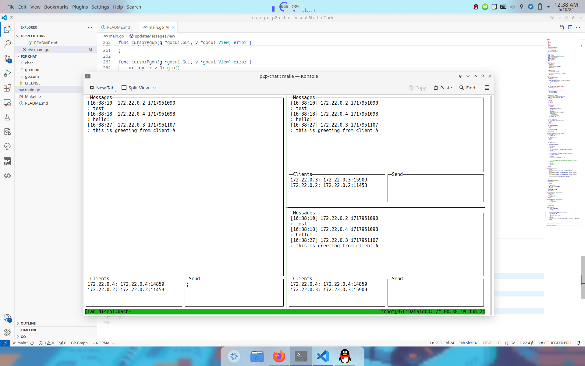
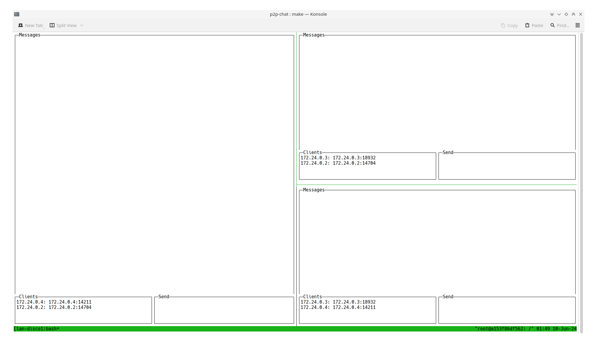
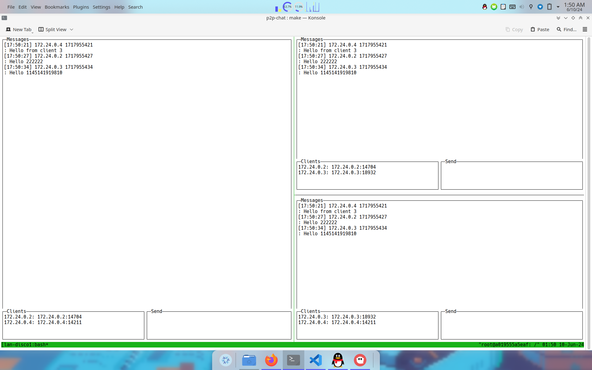

## 分布式计算第四次作业
一个包含多个Peer节点的P2P群聊系统.



## 功能
- 每个节点都保存完整的群聊过程记录
- 每个节点都允许用户发送自己的聊天信息，并提供gui实时显示完整群聊过程
- 显示完整的群聊过程要符合因果关系
- 假设模型：点对点拓扑；节点不会失效

## 设计思想

### 数据结构和全局变量
首先是数据层面，消息以下列的形式存储：

```go
type Message struct {
	ID        string `json:"id"`
	Timestamp int64  `json:"timestamp"`
	Msg       string `json:"msg"`
}
```

每个消息的`ID`格式如下：`IP:Port TimeStamp`，作为消息的唯一id值。或者这里可以使用`uuid`包作为更好的实现。

另外作为一个相对简单的单体项目，使用如下的全局变量简化了函数间的状态传递：

```go
var (
	clientID    string
	clientPort  int
	messages    []Message
	allMessages = make(map[string]Message)
	clients     = make(map[string]string) // id -> ip:port
	upgrader    = websocket.Upgrader{}
	ui          *gocui.Gui
	messageView = "messages"
	clientsView = "clients"
	sendView    = "send"
)
```

### 核心逻辑概述
软件的设计方面，核心部分的发现-消息传输流程如下：

- 在局域网中通过网段广播来全局发送自己的ip信息以让其他对等客户端发现自己
- 用WebSocket连接其他客户端，并拉取该客户端存储的消息，并入自己的全部消息列表
- 每个客户端维护自己发送过的所有消息，并对外暴露一个WebSocket端口以便其他Peer获取自己发送过的所有消息
- 发送消息时，将该消息添加到自己发送过的和所有的消息的列表，其他设备借助自身客户端暴露的IP来获得自己发送过的消息

上面的两个消息列表`allMessages`和`messages`都可以通过序列化/反序列化的方式在本地全量存储。

### 因果关系的保证

实验环境的测试借助了容器技术，在一台设备上启动了数个容器来测试局域网下各个客户端能否按照预期进行其他设备发现，获取其他设备的消息列表，发送消息和展示局域网内的所有消息。因为容器的时间和宿主机器保持一致，所以没有时差问题。如果有时差问题，每个消息都使用了局域网IP+端口+消息发送时间戳的方式来保证了消息的ID唯一性，从而保证了消息的唯一性，但是因果性依赖于时间同步，可以在局域网内启动一台ntp服务器解决。

### GUI的实现

在Golang的三方库中，有一个一直在积极维护的TUI(Terminal User Interface)库效果相对不错。因此界面部分使用这个库创建一个TUI作为交互界面。

详细代码分布在主程序中各个部分，下面是程序的界面定义过程：

```go
// UI implementation
func layout(g *gocui.Gui) error {
	maxX, maxY := g.Size()

	if v, err := g.SetView(messageView, 0, 0, maxX-1, maxY-6); err != nil {
		if err != gocui.ErrUnknownView {
			return err
		}
		v.Title = "Messages"
		v.Autoscroll = true
		v.Wrap = true
	}

	if v, err := g.SetView(clientsView, 0, maxY-6, maxX/2-1, maxY-1); err != nil {
		if err != gocui.ErrUnknownView {
			return err
		}
		v.Title = "Clients"
	}

	if v, err := g.SetView(sendView, maxX/2, maxY-6, maxX-1, maxY-1); err != nil {
		if err != gocui.ErrUnknownView {
			return err
		}
		v.Title = "Send"
		v.Editable = true
		if _, err := g.SetCurrentView(sendView); err != nil {
			return err
		}
	}
	return nil
}
```

或者，界面部分可以使用Qt和C++的组合/flutter+ffi的方案编写，将主程序部分编译为链接库的形式供GUI调用即可。但是受限于测试条件和复杂度，最终没有选择这种方案。

## 构建

项目开发语言为Golang，版本为`go version go1.22.4 linux/amd64`，使用Makefile在Linux上构建，测试设备的内核版本为`Linux 6.9.3-arch1-1`，使用Docker作为虚拟机环境进行局域网测试的模拟，借助tmux来辅助进行测试终端的展示和控制。构建脚本详见Makefile：

```make
all: chat

chat:
	@go build -o chat

clean:
	@rm chat

test:
	@docker network create lan-net

	@docker run -d --name node1 --network lan-net -v ./:/app ubuntu:latest sleep infinity
	@docker run -d --name node2 --network lan-net -v ./:/app ubuntu:latest sleep infinity
	@docker run -d --name node3 --network lan-net -v ./:/app ubuntu:latest sleep infinity

	@tmux new-session -d -s lan-discovery
	@tmux split-window -h
	@tmux split-window -v
	@tmux select-pane -t 0
	@tmux split-window -v

	@tmux select-pane -t 0
	@tmux send-keys "docker exec -it node1 bash" C-m

	@tmux select-pane -t 1
	@tmux send-keys "docker exec -it node2 bash" C-m

	@tmux select-pane -t 2
	@tmux send-keys "docker exec -it node3 bash" C-m

	@tmux select-pane -t 0
	@tmux send-keys "cd /app && ./chat" C-m

	@tmux select-pane -t 1
	@tmux send-keys "cd /app && ./chat" C-m

	@tmux select-pane -t 2
	@tmux send-keys "cd /app && ./chat" C-m

	@tmux attach -t lan-discovery
```

使用`make all`指令进行项目的构建，构建完成后，使用`make test`就可以借助docker自动创建虚拟局域网，并借助tmux自动开启三个ubuntu容器，并自动连接到三个窗格中启动构建好的客户端。效果如图：



此时，可以在三个客户端之间相互发送消息：



可以看到，三个客户端之间的消息是完全自动同步的，有客户端退出的话，它发送过的消息还会在其他端侧得以保留。

## LICENSE

项目使用`GNU General Public License V3`开源于[GitHub](https://github.com/xeonds/p2p-chat)，任何人可以在遵循协议的前提下自由使用。